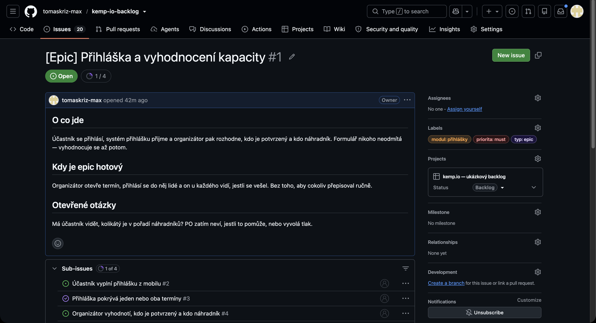
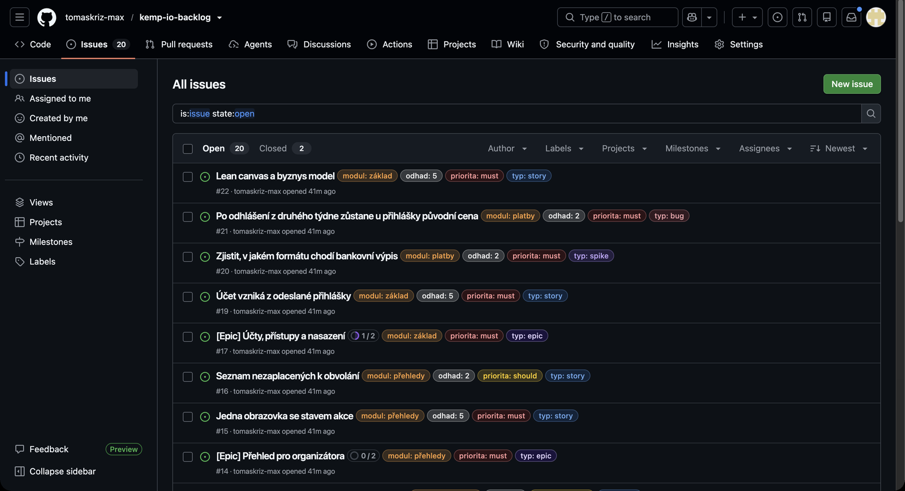
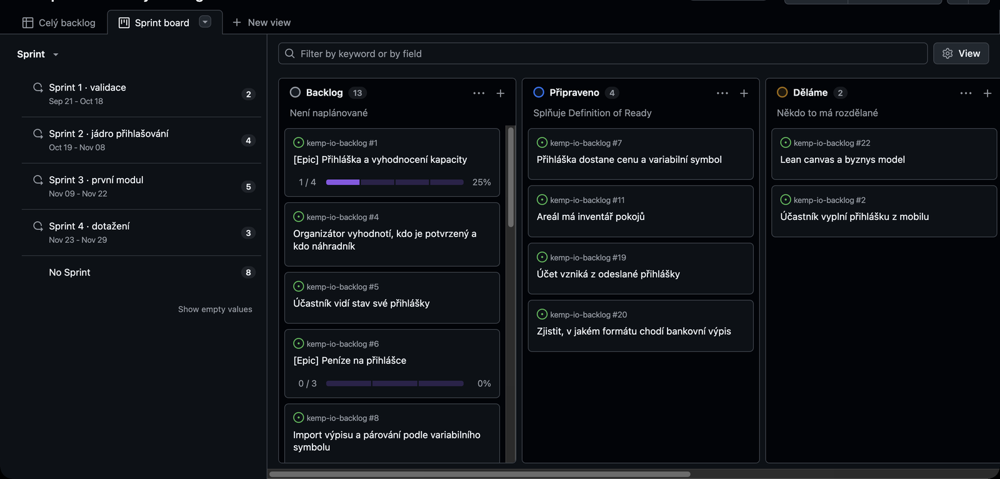
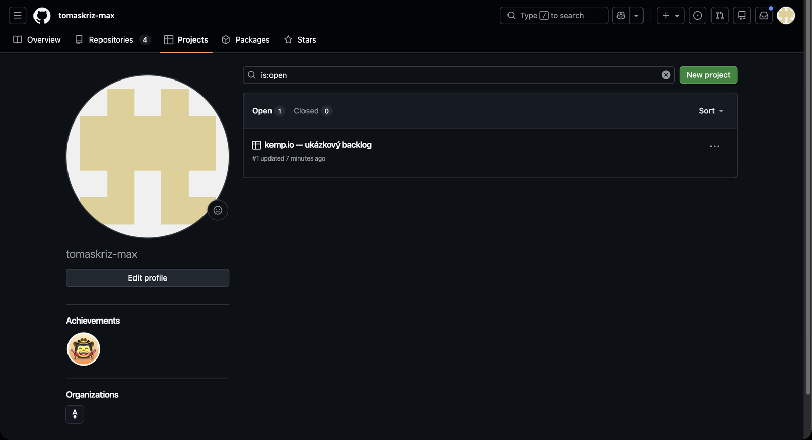
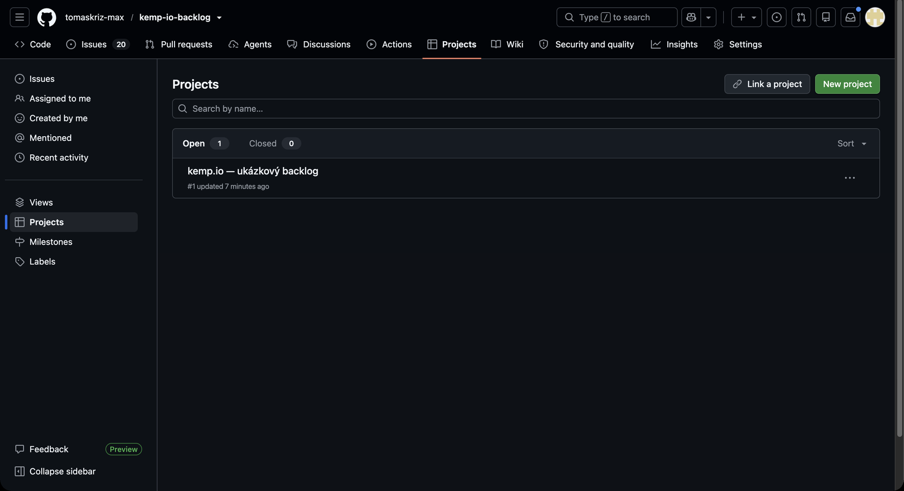
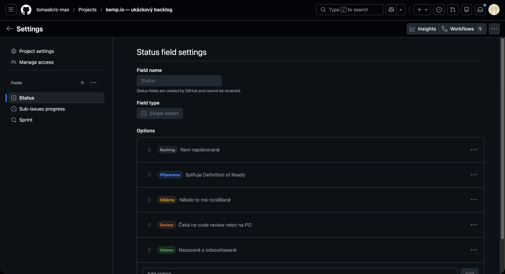
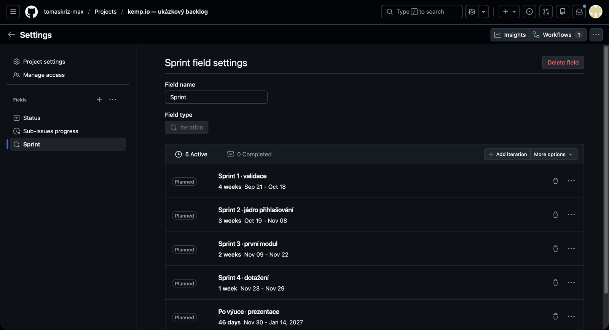
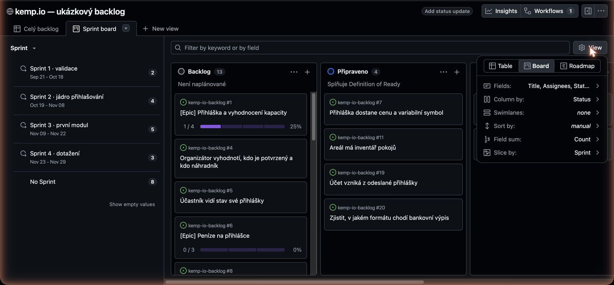
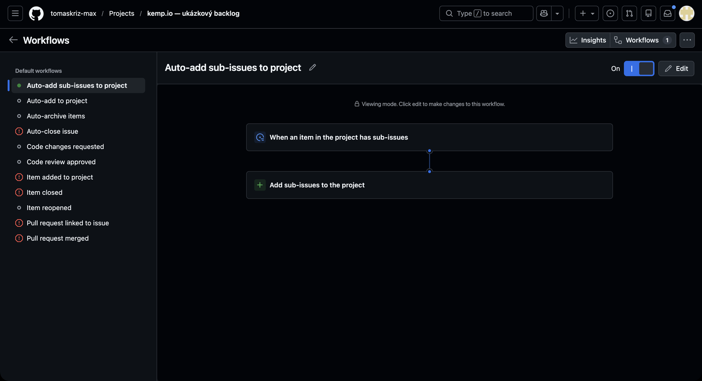

# Backlog a board na GitHubu

Návod pro týmy v kurzu. První polovina je **jak backlog vedeme**, druhá **jak si ho
nastavit**. Obrázky jsou z ukázkového repozitáře
[kemp-io-backlog](https://github.com/tomaskriz-max/kemp-io-backlog) a jeho
[boardu](https://github.com/users/tomaskriz-max/projects/1) — obojí je veřejné, můžete se tam
kdykoliv podívat.

---

# Část 1 — Jak backlog vedeme

## Dvě úrovně: epic a story

GitHub umí **sub-issues** — issue může mít pod sebou další issues.

- **Epic** je větší celek, který dává smysl jako kus produktu. Trvá víc než jeden sprint
  a sám o sobě se nedá vzít do práce. Štítek `typ: epic`.
- **Story** je kus práce, který jde dodat a ukázat na demu. Visí pod epicem. Štítek `typ: story`.

V epicu se seznam podřízených story objeví sám a GitHub k němu dopočítá postup — tady `1 / 4`.



Hlubší zanořování nedělejte. Když story potřebuje rozpad, je to nejspíš malý epic.

## Štítky

Pět skupin, každá jinou barvou. Na issue patří **právě jeden štítek z každé skupiny**
kromě `stav`, který se používá jen když něco drhne.

| Skupina | Štítky | K čemu |
|---|---|---|
| `typ` | epic · story · bug · chore · spike | co to je za práci |
| `modul` | přihlášky · ubytování · platby · doprava · přehledy · základ | kam to v produktu patří |
| `priorita` | must · should · could | co spadne první, když dojde čas |
| `odhad` | 1 · 2 · 3 · 5 · 8 | story pointy, přiděluje tým na planningu |
| `stav` | potřebuje upřesnit · blokováno | proč to zrovna neběží |



`spike` je časově omezené zjišťování, ne dodávka. Výstupem je odpověď, ne funkce.

## Sprinty jsou iterace

Na boardu je pole **Sprint** typu *iterace*. Není to štítek ani datum — GitHub o iteraci ví,
že má začátek a konec, takže sám pozná, která zrovna běží.

Sprinty jsou schválně nestejně dlouhé, přesně jak vychází semestr:

| Sprint | Od | Do | Délka | O čem to je |
|---|---|---|---|---|
| Sprint 1 · validace | 21. 9. | 19. 10. | 4 týdny | lean canvas, byznys, nasazená prázdná šablona |
| Sprint 2 · jádro přihlašování | 19. 10. | 9. 11. | 3 týdny | jedna cesta end-to-end, nasazená |
| Sprint 3 · první modul | 9. 11. | 23. 11. | 2 týdny | první modul z kostry |
| Sprint 4 · dotažení | 23. 11. | 30. 11. | 1 týden | jeden malý modul nebo nedodělky |
| Po výuce · prezentace | 30. 11. | 15. 1. | 6 týdnů | bez PO checkpointu, příprava prezentace |

Všimněte si toho tvaru: **4 – 3 – 2 – 1.** Sprinty se zkracují přesně ve chvíli, kdy roste
složitost. To není chyba rozvrhu — je to věc, se kterou musíte počítat při odhadech.

**Sprint dostávají jen story**, ne epiky. Epic běží napříč sprinty; kdyby měl vlastní sprint,
tvářil by se jako závazek na jednu iteraci a nebyla by to pravda.

Co nemá sprint, je neplánovaný backlog. To je v pořádku a je tam většina věcí.

## Board

Sloupce jsou stavy, vlevo se dá odkrojit jeden sprint. Tomu se v GitHubu říká **Slice by** —
je to filtr, ne rozdělení desky, takže board zůstane přehledný a jedním kliknutím vidíte
buď celek, nebo jednu iteraci.



Sloupce držíme jednoduché: **Backlog → Připraveno → Děláme → Review → Hotovo.**

Do `Děláme` patří jen to, co má někdo rozdělané. Když tam visí pět věcí na tři lidi,
něco je špatně.

## Definition of Ready

Story se nebere do sprintu, dokud:

- je jasné, **komu** to pomůže a **proč**
- má akceptační kritéria, na kterých se tým shodl
- vejde se do sprintu — když ne, rozdělte ji
- nemá otevřenou otázku, která by mohla změnit zadání

## Definition of Done

- funguje to na **nasazeném prostředí**, ne na localhostu
- prošlo to code review
- PO si to může sám proklikat na datech, která si vymyslí na místě

---

# Část 2 — Jak si to nastavit

Dvě cesty ke stejnému výsledku. Skriptem to trvá minutu, ručně asi deset — ale uvidíte,
kde co je, a to se bude hodit, až budete něco měnit.

## Rychlá cesta: skriptem

Potřebujete [gh CLI](https://cli.github.com) přihlášené a se scopem `project`:

```bash
gh auth login
gh auth refresh -s project
```

Pak z kořene svého repozitáře:

```bash
./scripts/setup-board.sh <owner>/<repo> "Název boardu"
```

**Data sprintů si nejdřív upravte** — jsou nahoře ve skriptu v poli `SPRINTS`
jako `název|začátek|délka ve dnech`.

Skript udělá všechno kromě posledních dvou kroků ruční cesty; ty přes API udělat nejdou.

## Ruční cesta

### 1. Založit projekt

Na **svém profilu** (ne v repu) → záložka **Projects** → **New project** → šablona **Board**.



Projekt patří účtu, ne repozitáři. To je správně — jeden board může sledovat víc repozitářů.

### 2. Propojit s repozitářem

V repu → záložka **Projects** → **Link a project** → vyberte ten svůj.



Od téhle chvíle jde issue přidat na board přímo z jejího postranního panelu.

### 3. Přepsat sloupce

Na boardu **⋯** vpravo nahoře → **Settings** → v levém sloupci **Status**.



Přejmenujte a doplňte, ať jich je pět. Popisky pod názvem nejsou povinné, ale ušetří dohady
o tom, co do kterého sloupce patří.

### 4. Přidat pole Sprint

Pořád v **Settings** → u seznamu polí **+** → **New field**.

- **Field name:** `Sprint`
- **Field type:** `Iteration`



Nastavte začátek prvního sprintu a přidávejte další tlačítkem **Add iteration**.
**Délku každé iterace jde změnit zvlášť** — využijte toho, sprinty v semestru nejsou
stejně dlouhé.

### 5. Nastavit Slice by

Zpátky na board → tlačítko **View** vpravo v řádku filtru → **Slice by** → `Sprint`.



Pozor na názvy: **Column by** určuje sloupce (necháme `Status`), **Swimlanes** rozřeže desku
na vodorovné pruhy a **Slice by** přidá ten levý panel. Na tabulkovém pohledu se stejná věc
jmenuje **Group by**.

Změnu je potřeba potvrdit přes **Save view**, jinak platí jen pro vás a jen do zavření.

### 6. Zapnout automatické přidávání

**Workflows** vpravo nahoře → **Auto-add to project** → **Edit** → vyberte repozitář → *Enable*.



Bez tohohle kroku si každé nové issue musíte na board přetáhnout ručně a jednou týdně
zjistíte, že vám tam něco chybí.

---

## Co ještě stojí za zapnutí

**Šablony issues.** Zkopírujte si složku [`.github/ISSUE_TEMPLATE`](.github/ISSUE_TEMPLATE)
do svého repozitáře. Drží tvar story — situace, akceptační kritéria, co do ní nepatří,
otevřené otázky — a ušetří to na refinementu spoustu dohadování.

**Štítky.** Výchozí anglické štítky smažte a naše si přeneste jedním průchodem:

```bash
gh label list -R tomaskriz-max/kemp-io-backlog --json name,color,description \
  | jq -r '.[] | [.name, .color, .description] | @tsv' \
  | while IFS=$'\t' read -r n c d; do
      gh label create "$n" -R <owner>/<repo> -c "$c" -d "$d" --force
    done
```

**Sub-issues.** V otevřeném issue je v pravém panelu sekce **Sub-issues** → *Add sub-issue*.
Můžete přidat existující issue nebo rovnou založit nové.

---

Dobrá story říká **situaci a co z ní má vzejít**. Neříká, jak to naprogramovat — to je vaše
rozhodnutí a bylo by škoda si ho ubrat.
